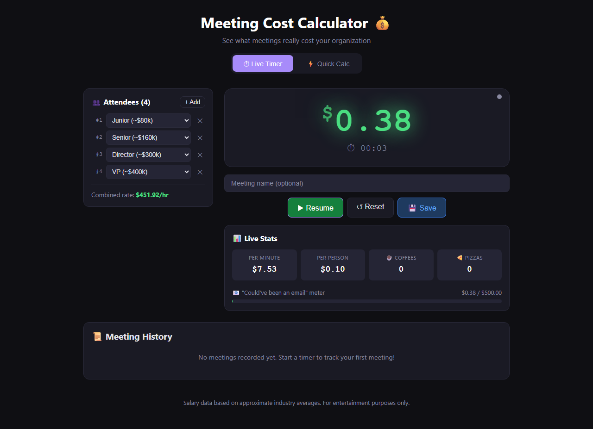

# Meeting Cost Calculator 💰

Ever wonder how much that meeting *actually* cost? Now you can find out — in real time.

🌐 **[Live Demo](https://vineeththomasalex.github.io/meeting-cost-calculator/)**



## Features

- **⏱ Live Timer** — Start a meeting timer and watch the cost tick up in real time based on who's in the room
- **⚡ Quick Calculator** — Estimate the cost of any meeting by plugging in attendees, roles, and duration
- **👥 Role-Based Rates** — Select from common industry roles (Junior through VP) with approximate salary bands
- **📊 Fun Stats** — See per-minute cost, cost per person, and how many ☕ coffees or 🍕 pizzas the meeting is worth
- **📧 "Could've Been an Email" Meter** — A progress bar that fills up as your meeting gets expensive
- **📜 Meeting History** — Save and review past meetings, stored in your browser's localStorage
- **🎨 Color-Coded Cost** — The ticker changes from green → yellow → orange → red as costs climb

## Tech Stack

- **React 19** with TypeScript
- **Vite** for blazing-fast dev and builds
- **localStorage** for persistent meeting history
- **requestAnimationFrame** for smooth, accurate cost ticking
- **Playwright** for end-to-end testing

## Getting Started

```bash
# Install dependencies
npm install

# Start dev server
npm run dev

# Build for production
npm run build

# Preview production build
npm run preview

# Run tests
npx playwright test
```

## Testing

```bash
# Install Playwright browsers (first time only)
npx playwright install chromium

# Run all end-to-end tests
npx playwright test

# Run tests with UI
npx playwright test --ui
```

## Salary Data

All salary figures are **generic industry averages** for illustration purposes only. They do not represent any specific company's compensation. The app is intended for fun and awareness — not as an actual financial tool.

| Role       | Approximate Salary |
|------------|-------------------|
| Junior     | ~$80k             |
| Mid-Level  | ~$120k            |
| Senior     | ~$160k            |
| Staff      | ~$200k            |
| Principal  | ~$250k            |
| Director   | ~$300k            |
| VP         | ~$400k            |

## License

MIT
